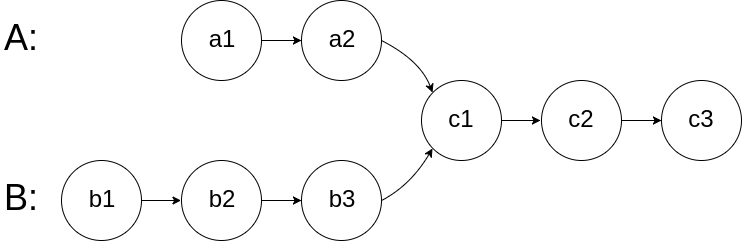
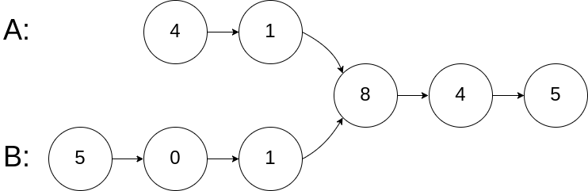
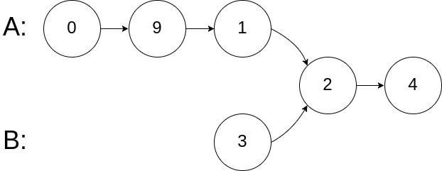
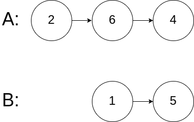
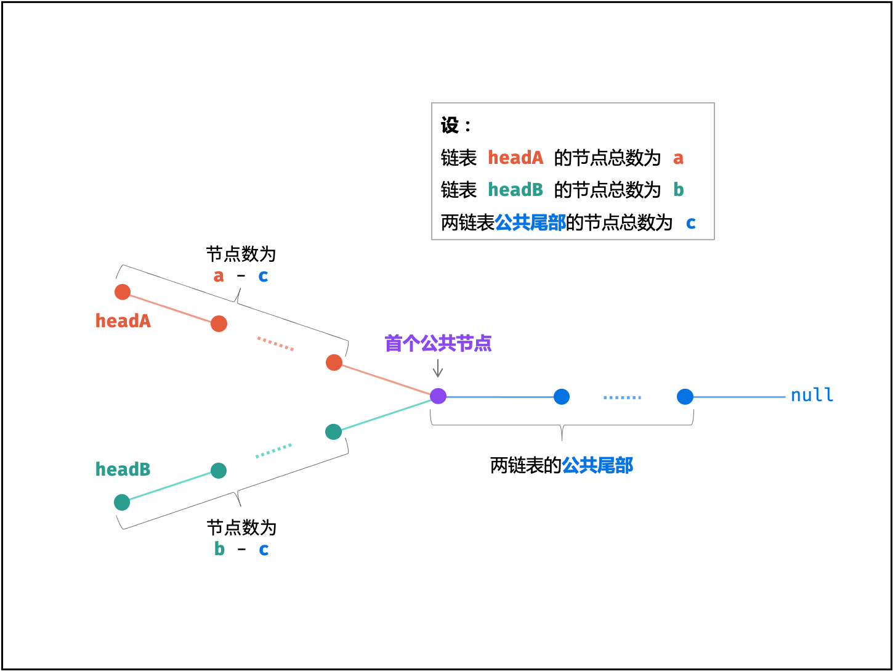

# 两个链表的第一个公共节点

## 题意

输入两个链表，找出它们的第一个公共节点。

如下面的两个链表：



在节点 c1 开始相交。


### 示例 1：




输入：intersectVal = 8, listA = [4,1,8,4,5], listB = [5,0,1,8,4,5], skipA = 2, skipB = 3
输出：Reference of the node with value = 8

输入解释：相交节点的值为 8 （注意，如果两个列表相交则不能为 0）。从各自的表头开始算起，链表 A 为 [4,1,8,4,5]，链表 B 为 [5,0,1,8,4,5]。在 A 中，相交节点前有 2 个节点；在 B 中，相交节点前有 3 个节点。
 

### 示例 2：




输入：intersectVal = 2, listA = [0,9,1,2,4], listB = [3,2,4], skipA = 3, skipB = 1
输出：Reference of the node with value = 2

输入解释：相交节点的值为 2 （注意，如果两个列表相交则不能为 0）。从各自的表头开始算起，链表 A 为 [0,9,1,2,4]，链表 B 为 [3,2,4]。在 A 中，相交节点前有 3 个节点；在 B 中，相交节点前有 1 个节点。


### 示例 3：




输入：intersectVal = 0, listA = [2,6,4], listB = [1,5], skipA = 3, skipB = 2
输出：null

输入解释：从各自的表头开始算起，链表 A 为 [2,6,4]，链表 B 为 [1,5]。由于这两个链表不相交，所以 intersectVal 必须为 0，而 skipA 和 skipB 可以是任意值。
解释：这两个链表不相交，因此返回 null。
 

注意：
如果两个链表没有交点，返回 null.
在返回结果后，两个链表仍须保持原有的结构。
可假定整个链表结构中没有循环。
程序尽量满足 O(n) 时间复杂度，且仅用 O(1) 内存。


## 解法



考虑构建两个节点指针 A​ , B 分别指向两链表头节点 headA , headB ，做如下操作：

指针 A 先遍历完链表 headA ，再开始遍历链表 headB ，当走到 node 时，共走步数为：
a + (b - c)

指针 B 先遍历完链表 headB ，再开始遍历链表 headA ，当走到 node 时，共走步数为：
b + (a - c)

如下式所示，此时指针 A , B 重合，并有两种情况：

a + (b - c) = b + (a - c)

若两链表 有 公共尾部 (即 c > 0c>0 ) ：指针 A , B 同时指向「第一个公共节点」node 。
若两链表 无 公共尾部 (即 c = 0c=0 ) ：指针 A , B 同时指向 nullnull 。
因此返回 A 即可。

```js
/**
 * Definition for singly-linked list.
 * function ListNode(val) {
 *     this.val = val;
 *     this.next = null;
 * }
 */
 
/**
 * @param {ListNode} headA
 * @param {ListNode} headB
 * @return {ListNode}
 */
var getIntersectionNode = function(headA, headB) {
    var node1 = headA;
    var node2 = headB;
 
    while(node1 !== node2){
        node1 = node1 !== null ? node1.next : headB;
        node2 = node2 !== null ? node2.next : headA;
    }
    return node1;
};
```
