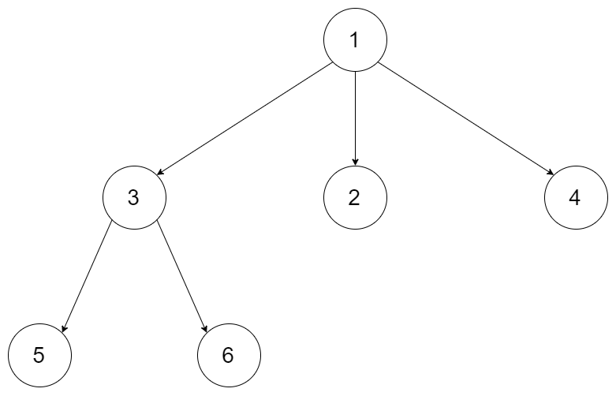
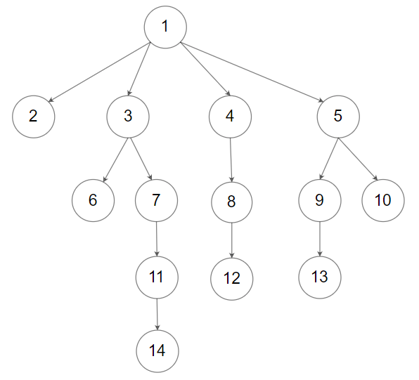

# N叉树的前序遍历

## 题意

给定一个 N 叉树，返回其节点值的 前序遍历 。  
N 叉树 在输入中按层序遍历进行序列化表示，每组子节点由空值 null 分隔（请参见示例）。


进阶：

递归法很简单，你可以使用迭代法完成此题吗?


- 示例 1：



```
输入：root = [1,null,3,2,4,null,5,6]
输出：[1,3,5,6,2,4]
```

- 示例 2：



```
输入：root = [1,null,2,3,4,5,null,null,6,7,null,8,null,9,10,null,null,11,null,12,null,13,null,null,14]
输出：[1,2,3,6,7,11,14,4,8,12,5,9,13,10]
```

提示：  
N 叉树的高度小于或等于 1000   
节点总数在范围 [0, 10^4] 内   


## 解法 

### 一、递归法

```js
/**
 * // Definition for a Node.
 * function Node(val, children) {
 *    this.val = val;
 *    this.children = children;
 * };
 */
 
/**
 * @param {Node|null} root
 * @return {number[]}
 */
var preorder = function(root) {
    const result = []; // 存储结果
    seek(root, result);
    return result;
 
    function seek(node, result){
        if(node == null){
            return;
        }
 
        result.push(node.val);
 
        const childs = node.children;
        if(childs == null){
            return;
        }
        childs.forEach(item => {
            seek(item, result);
        });
    }
};
```

### 二、迭代法

```js
/**
 * // Definition for a Node.
 * function Node(val, children) {
 *    this.val = val;
 *    this.children = children;
 * };
 */
 
/**
 * @param {Node|null} root
 * @return {number[]}
 */
var preorder = function(root) {
    const result = []; // 存储结果
    const stack = []; // 存储调用栈
    let node = root;
 
    while(stack.length > 0 || node !== null){
        // 先深度遍历第一个child
        while(node !== null){
            result.push(node.val);
            const children = node.children;
            if(children == null || children.length < 1){
                break;
            }
            node = children[0]; // 取出第一个child
            let index = children.length - 1;
            while(index > 0){
                // 这里需要注意存入栈的顺序，因为出栈是pop，所以入栈要倒序
                stack.push(children[index--]); // 其他child存入调用栈中，等待执行
            }
        }
 
        // 深度遍历第一个child后，取出stack栈中的child
        if(stack.length > 0){
            node = stack.pop();
        }else{
            node = null; // 栈中没有节点后，要重置为Null,避免死循环
        }
    }
 
    return result;
};
```
