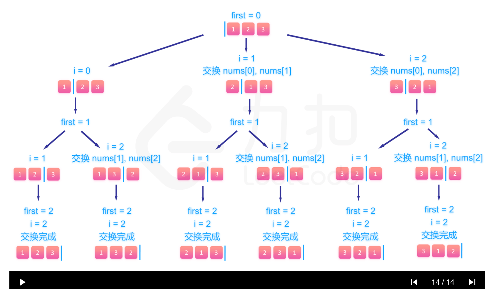

# 全排列

## 题目信息

给定一个不含重复数字的数组 nums ，返回其 所有可能的全排列 。你可以 按任意顺序 返回答案。


- 示例 1：

输入：nums = [1,2,3]
输出：[[1,2,3],[1,3,2],[2,1,3],[2,3,1],[3,1,2],[3,2,1]]

- 示例 2：

输入：nums = [0,1]
输出：[[0,1],[1,0]]

- 示例 3：

输入：nums = [1]
输出：[[1]]
 

提示：
1 <= nums.length <= 6
-10 <= nums[i] <= 10
nums 中的所有整数 互不相同

----

## 解法

如下图所示，依次确定第1位的数字，然后再对剩下的数字集合`nextPickArr`按数组下标，进行提取。
每次从`nextPickArr`取出数字后，就更新`nextPickArr`数组，将取出的数字从该数组中剔除，直至`nextPickArr`为空，就是一个解。

回溯算法，主要是利用递归的特性，用函数参数传参的方式，去固定好上下文环境的取值。




```js
/**
 * @param {number[]} nums
 * @return {number[][]}
 */
 var permute = function(nums) {
    let result = [];
 
    for(let i = 0; i < nums.length; i++){
        let nextPickArr = [...nums];// 由于splice会改变原数组，所以这里需要重新拷贝一份
        let currentNums = nextPickArr.splice(i, 1); // splice方法是改变原数组，返回的是当前切割出来的值
        // 传入result，是为了接收结果
        swap(result, currentNums, nextPickArr);
    }
 
    return result;
 
    /**
     *
     *
     * @param {*} result 存储结果
     * @param {*} storeArr　当前已排列好的数组
     * @param {*} pickArr　待选择的数组内容
     * @returns
     */
    function swap(result, storeArr, pickArr){
        // 当待排列的数组为空时，代表已经排列完成
        if(pickArr.length < 1){
            result.push(storeArr);
            return;
        }
 
        for(let i = 0; i < pickArr.length; i++){
            let nextPickArr = [...pickArr];
            let currentNums = nextPickArr.splice(i, 1);;
            swap(result, [...storeArr, ...currentNums], nextPickArr);
        }
    }
};
 

```
