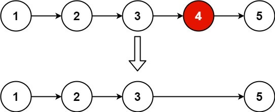

# 删除链表的倒数第 N 个结点

## 题意

给你一个链表，删除链表的倒数第 n 个结点，并且返回链表的头结点。  

进阶：你能尝试使用一趟扫描实现吗？  


- 示例 1：  



```
输入：head = [1,2,3,4,5], n = 2
输出：[1,2,3,5]
```

- 示例 2：
```
输入：head = [1], n = 1
输出：[]
```

- 示例 3：
```
输入：head = [1,2], n = 1
输出：[1]
```
 

提示：
```
链表中结点的数目为 sz
1 <= sz <= 30
0 <= Node.val <= 100
1 <= n <= sz
```


## 解法

利用快慢指针，进行求解，详细见注释

```js
/**
 * Definition for singly-linked list.
 * function ListNode(val, next) {
 *     this.val = (val===undefined ? 0 : val)
 *     this.next = (next===undefined ? null : next)
 * }
 */
/**
 * @param {ListNode} head
 * @param {number} n
 * @return {ListNode}
 */
var removeNthFromEnd = function(head, n) {
    if(head == null){
        return head;
    }
    // 快指针先走N步
    let fast = head;
    let index = n;
    while(index > 0){
        fast = fast.next;
        index--;
    }
    // 如果快指针是null，则证明要删除的是第一个节点
    if(fast == null){
        return head.next;
    }
    let slow = head;
    // 快慢指针同向前进，直到快指针到达链表最后一个非null节点
    // 这时，slow指针指向倒数第n+1个节点
    while(fast.next !== null){
        slow = slow.next;
        fast = fast.next;
    }
    // 删除倒数第n个节点
    let next = slow.next;
    if(next !== null){
        next = next.next;
    }
    slow.next = next;
    return head;
};
```
