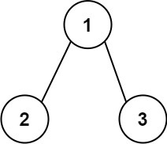
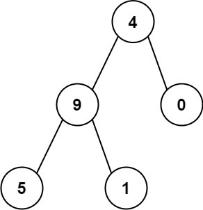

# 求根节点到叶节点数字之和

## 题意
给你一个二叉树的根节点 root ，树中每个节点都存放有一个 0 到 9 之间的数字。  
每条从根节点到叶节点的路径都代表一个数字：   

例如，从根节点到叶节点的路径 1 -> 2 -> 3 表示数字 123 。   
计算从根节点到叶节点生成的 所有数字之和 。   

叶节点 是指没有子节点的节点。   


- 示例 1：



```
输入：root = [1,2,3]
输出：25
```

解释：  
从根到叶子节点路径 1->2 代表数字 12   
从根到叶子节点路径 1->3 代表数字 13  
因此，数字总和 = 12 + 13 = 25  


- 示例 2：  



```
输入：root = [4,9,0,5,1]
输出：1026
```

解释：   
从根到叶子节点路径 4->9->5 代表数字 495  
从根到叶子节点路径 4->9->1 代表数字 491  
从根到叶子节点路径 4->0 代表数字 40  
因此，数字总和 = 495 + 491 + 40 = 1026  
 

```
提示：  
树中节点的数目在范围 [1, 1000] 内
0 <= Node.val <= 9
树的深度不超过 10
```


## 解法

### 一、递归
使用递归方式进行求解，解题的最关键点是，通过调用栈，利用参数缓存上一次的结果。  
如果当前是非叶子节点，则需要将上一次结果乘以10，再与当前节点相加。  

```js
/**
 * Definition for a binary tree node.
 * function TreeNode(val, left, right) {
 *     this.val = (val===undefined ? 0 : val)
 *     this.left = (left===undefined ? null : left)
 *     this.right = (right===undefined ? null : right)
 * }
 */
/**
 * @param {TreeNode} root
 * @return {number}
 */
var sumNumbers = function(root) {
 
    return seek(root, 0);
 
    function seek(node, preSum){
        if(node == null){
            return 0;
        }
 
        const sum = preSum * 10 + node.val;
 
        if(node.left == null && node.right == null){
            // 叶子节点
            return sum;
        }
 
        // 递归累加
        return seek(node.left, sum) + seek(node.right, sum);
    }
};
```


### 二、迭代法

将递归的参数，显式缓存在sumStack数组中。

```js
/**
 * Definition for a binary tree node.
 * function TreeNode(val, left, right) {
 *     this.val = (val===undefined ? 0 : val)
 *     this.left = (left===undefined ? null : left)
 *     this.right = (right===undefined ? null : right)
 * }
 */
/**
 * @param {TreeNode} root
 * @return {number}
 */
var sumNumbers = function(root) {
    const nodeStack = []; // 存储当前访问的节点
    const sumStack = []; // 存储当前访问过的节点的相加值
    let sum = 0; // 总和
 
    nodeStack.push(root);
    sumStack.push(root.val);
 
    while(nodeStack.length > 0){
        const node = nodeStack.pop();
        const val = sumStack.pop();
 
        if(node.left == null && node.right == null){
            // 叶子节点
            sum += val;
        }
        if(node.left !== null){
            nodeStack.push(node.left);
            sumStack.push(val*10 + node.left.val);
        }
        if(node.right !== null){
            nodeStack.push(node.right);
            sumStack.push(val*10 + node.right.val);
        }
    }
 
    return sum;
};
```
