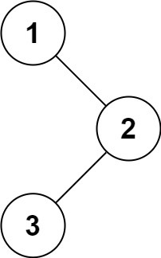
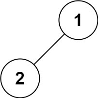
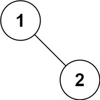

# 二叉树的前序遍历

## 题意

给你二叉树的根节点 root ，返回它节点值的 前序 遍历。

- 示例 1：



```
输入：root = [1,null,2,3]
输出：[1,2,3]
```

- 示例 2：  

```
输入：root = []
输出：[]
```

- 示例 3：

```
输入：root = [1]
输出：[1]
```

- 示例 4：



```
输入：root = [1,2]
输出：[1,2]
```

示例 5：



```
输入：root = [1,null,2]
输出：[1,2]
```

提示：
```
树中节点数目在范围 [0, 100] 内
-100 <= Node.val <= 100
```

进阶：递归算法很简单，你可以通过迭代算法完成吗？


## 解法

### 解法一

使用递归的方式，对节点进行逐个访问。   
使用的是隐式的调用栈来存储上次访问节点的信息。   

```js
/**
 * Definition for a binary tree node.
 * function TreeNode(val, left, right) {
 *     this.val = (val===undefined ? 0 : val)
 *     this.left = (left===undefined ? null : left)
 *     this.right = (right===undefined ? null : right)
 * }
 */
/**
 * @param {TreeNode} root
 * @return {number[]}
 */
var preorderTraversal = function(root) {
    const result = [];
    seek(root, result);
    return result;
 
    function seek(node, result){
        if(node == null){
            return;
        }
        result.push(node.val);
 
        seek(node.left, result);
        seek(node.right, result);
    } 
};
```

### 解法二

使用迭代方式，显式存储调用栈。

```js
/**
 * Definition for a binary tree node.
 * function TreeNode(val, left, right) {
 *     this.val = (val===undefined ? 0 : val)
 *     this.left = (left===undefined ? null : left)
 *     this.right = (right===undefined ? null : right)
 * }
 */
/**
 * @param {TreeNode} root
 * @return {number[]}
 */
var preorderTraversal = function(root) {
    const result = []; // 结果
    const stack = [];// 存储调用栈
 
    if(root == null){
        return result;
    }
 
    let node = root;
 
    while(stack.length > 0 || node !== null){
        while(node !== null){
            stack.push(node);
            result.push(node.val);
            node = node.left; // 当左节点不是null时，则一直深度遍历下去
        }
        if(stack.length > 0){
            node = stack.pop(); // 取出父节点
            // 这里有关键的一点：当node.right为null时，则代表是右叶子。
            // 当stack.length > 0时，会再取出下一个未处理右节点的父节点出来
            node = node.right; 
        }
    }
 
    return result;
};
```
