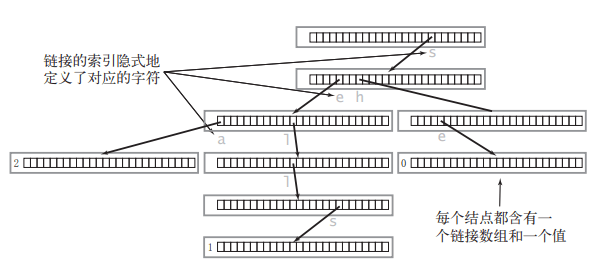
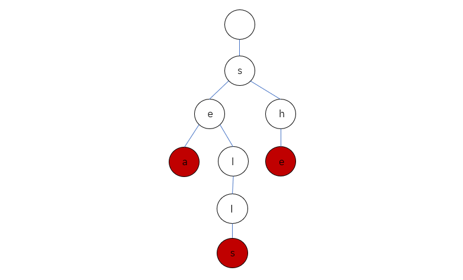

# 实现 Trie (前缀树)

## 题意

Trie（发音类似 "try"）或者说 前缀树 是一种树形数据结构，用于高效地存储和检索字符串数据集中的键。这一数据结构有相当多的应用情景，例如自动补完和拼写检查。  

请你实现 Trie 类：  

Trie() 初始化前缀树对象。  
void insert(String word) 向前缀树中插入字符串 word 。  
boolean search(String word) 如果字符串 word 在前缀树中，返回 true（即，在检索之前已经插入）；否则，返回 false 。  
boolean startsWith(String prefix) 如果之前已经插入的字符串 word 的前缀之一为 prefix ，返回 true ；否则，返回 false 。  
 

示例：  
```
输入
["Trie", "insert", "search", "search", "startsWith", "insert", "search"]  
[[], ["apple"], ["apple"], ["app"], ["app"], ["app"], ["app"]]  
输出  
[null, null, true, false, true, null, true]  
```
```
解释
Trie trie = new Trie();  
trie.insert("apple");  
trie.search("apple");   // 返回 True
trie.search("app");     // 返回 False
trie.startsWith("app"); // 返回 True
trie.insert("app");
trie.search("app");     // 返回 True
```
 

提示：
```
1 <= word.length, prefix.length <= 2000
word 和 prefix 仅由小写英文字母组成
insert、search 和 startsWith 调用次数 总计 不超过 3 * 104 次
```


## 解法

Trie 树（又叫「前缀树」或「字典树」）是一种用于快速查询「某个字符串/字符前缀」是否存在的数据结构。  

其核心是使用「边」来代表有无字符，使用「点」来记录是否为「单词结尾」以及「其后续字符串的字符是什么」。





```js
/**
 * Initialize your data structure here.
 */
var Trie = function() {
    this.node = {};
};
 
// 判断当前prefix是否存在
Trie.prototype.prefix = function(word){
    var node = this.node;
    for(var ch of word){
        if(typeof node == 'undefined' || typeof node[ch] == 'undefined'){
            return false;
        }
        node = node[ch];
    }
    return node;
}
 
/**
 * Inserts a word into the trie. 
 * @param {string} word
 * @return {void}
 */
Trie.prototype.insert = function(word) {
    var node = this.node;
    for(var ch of word){
        if(typeof node[ch] == 'undefined'){
            node[ch] = {};
        }
        node = node[ch];
    }
    node.isEnd = true; // 标记当前单词结尾
    return node;
};
 
/**
 * Returns if the word is in the trie. 
 * @param {string} word
 * @return {boolean}
 */
Trie.prototype.search = function(word) {
    var node = this.prefix(word);
    if(node == false){
        return false;
    }
    if(node.isEnd !== true){
        return false;
    }
    return true;
};
 
/**
 * Returns if there is any word in the trie that starts with the given prefix. 
 * @param {string} prefix
 * @return {boolean}
 */
Trie.prototype.startsWith = function(prefix) {
    var node = this.prefix(prefix);
    if(node == false){
        return false;
    }
 
    return true;
};
 
/**
 * Your Trie object will be instantiated and called as such:
 * var obj = new Trie()
 * obj.insert(word)
 * var param_2 = obj.search(word)
 * var param_3 = obj.startsWith(prefix)
 */
```
